# Lesson 02: Foundations of the technology stack: HTML, CSS, and JavaScript

## Overview 

This lesson will provide you with an introduction to the foundational technology stack used in web map development. We will introduce you to 3 distinct web technologies (HTML, CSS, and JavaScript), which work together to produce a web page and map application. Web map design is achieved using these three technologies to structure **content** (HTML), and give **form** (CSS) and **behavior** (JavaScript) to this content. We define design in this sense as the convergence of content, form, and behavior.

Additionally, we'll practice writing these technologies within our powerful text editor, Brackets, as well as the use of browser developer tools to inspect the Document Object Module (DOM) and debug our code. 

## Understanding the HTML document and Document Object Model (DOM)

Begin by opening the entire module-02 directory in Brackets (i.e., with Brackets open, go to **File -> Open Folder**). Double-click on the *index.html* file within the *lesson-02-data* directory so that it opens within your **Working Files** within Brackets. We'll use this basic template within this lesson.

Note that to complete this module and lab assignment you'll need to follow the instructions detailed at the end of module 01 for using Git within this course. For this module, you'll want first to pull down any updates from our remote *map672-fall16* repository to your local copy of our repo, and then manually copy any new directories into your personal *map672* repository. Commit these changes (e.g., "add module 02") and then begin.

While you could open this *index.html*  file directly in your web browser by double-clicking on the file, we're going to take advantage of the **web server** capabilities within Brackets. Instead of just reading the contents of the file, we want our browser to make what's known as an "HTTP request" for the file, and for that file to be "served" back to the browser with a response. 

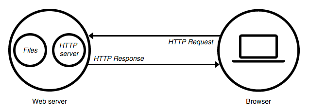  
Figure 01. Model of the HTTP request and response of the web server

Web pages get delivered to your browser because a remote (vs. local) web server "handles" your request. Read more about [What is a web server?](https://developer.mozilla.org/en-US/Learn/What_is_a_web_server).

The important thing to understand is the difference between our web browser reading the file from a location on our hard drive (e.g., *file:///Users/NewMaps/Documents/map672/module-02/lesson-02-data/index-01.html*) and our browser making this HTTP request from a local web server. We want to use the latter when doing web map development, and Brackets provides this local web server for us.

To launch a local web server using Brackets, and with your *index.html* selected within your **Working Files**, click the lightning bolt in the upper right corner of Brackets (or go to **File -> Live Preview**). 

Your document will open in your web browser using a local web server. Note that the URL in the browser is not a relative path to a location on the computer (i.e., *:///Users/NewMaps/Documents/...*), but rather it's a URL that looks like *http://127.0.0.1:50090/module-02/lesson-02-data/index-01.html*. Pay attention throughout this course and make sure you see this *http://127.0.0.1:50090/* within your URL when testing your application. Otherwise, the web document will not load external files or render correctly.

Note that we currently have a visually underwhelming blank white web page.

<!--
  
Figure 02. Basic template web page
-->

Within your open *index.html* file, replace the text `<!-- HTML written here -->` with the following line of HTML:

```html
<h1>Awesome map!</h1>

```

Brackets' Live Preview will likely update the web page automatically (if not, refresh your browser page to see the updates). We've added our first HTML element to the web page:

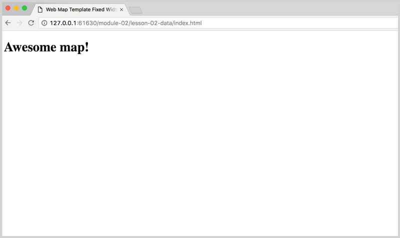  
Figure 02. Basic template web page with h1 tags.

Before we move forward to begin learning what all the HTML is doing, let's learn about another essential piece of our development toolkit: browser developer tools. 

### using the browser developer tools

Modern web browsers come installed with powerful tools for helping us develop our web applications. These are known as browser developer tools, which are useful for letting us look "beneath" the web page, as well as allowing our JavaScript "talk" to our web browser through what's known as the JavaScript Console.

For many years, development tools and a JavaScript Console existed as additional plugins that web designers and developers could install in their browser. Most modern browsers of today (i.e., Chrome, Firefox, Safari, IE10+) come with these tools built into the browser itself. We'll be exploring these tools in greater detail through the course, but for now, we want to get to know our browser JavaScript Console. 

We're going to demonstrate using Chrome's web developer tools (though Mozilla Firefox's developer tool is great as well). Read more about using the [JavaScript Console in Chrome](https://developer.chrome.com/devtools/docs/console).

With your *index.html* open (using the **Live Preview** of Brackets), access the **developer tools** through the options (upper-right corner of Chrome).

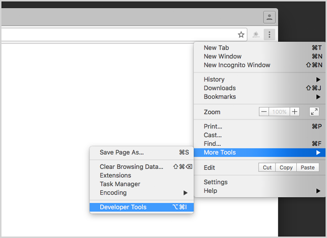  
Figure 03. Opening the developer tools within Chrome.  

By default the developer tools open alongside the bottom of your browser window. You can move the tools to display along the side, or within a separate detached window. Drag to increase the height of the tools if you need to and be sure the **Elements** tab is active at the left, along with the row of options at the top.

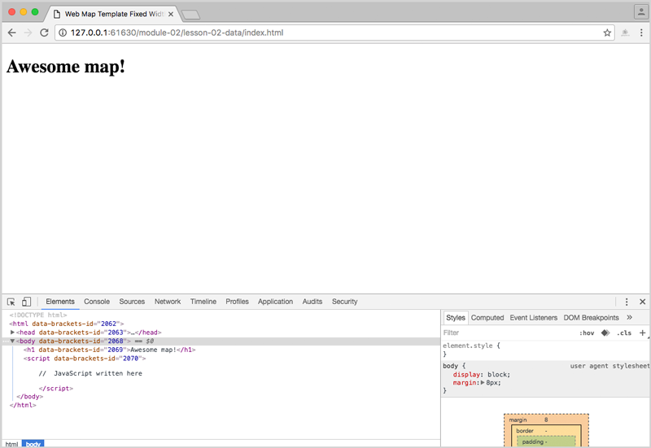  
Figure 04. Chrome's developer tools open.

If we carefully compare our HTML in the *index.html* file with what the developer tools show us, we can see they match. In other words, we can see the code `<!DOCTYPE html>`, `<html>`, etc., contained within the *index.html* file within the developer toolbar.

However, note that Brackets dynamically inserted a bunch of its code into the DOM (i.e., anything beginning with "data-brackets").

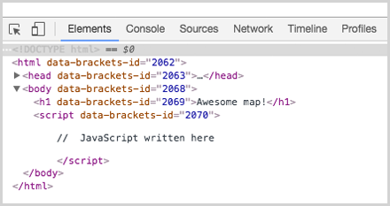  
Figure 05. Brackets data-attributes-id attribute included in DOM.

Refresh the browser again with the developer tools open, and you'll see the DOM as it is without inserted Brackets' code. Note that it's often good practice to refresh the browser with the tools open to first remove Brackets' code (which thereby disables the Auto Live Preview).

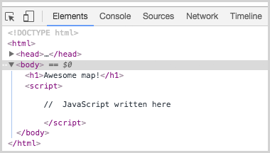  
Figure 06. Web developer toolbar refreshed to remove Brackets attributes.

We'll use these tools to explore the [**Document Object Model**, or **DOM**](https://developer.mozilla.org/en-US/docs/Web/API/Document_Object_Model). The DOM is an interface between all the technologies that come together to produce our web page, and it provides a structured representation of our web page. It is hierarchical and consists of nested node objects (parent nodes and child nodes). These nodes all have particular characteristics and behaviors. For instance, within our starter template *index.html* page, the large text at the top that says "Awesome map!" is a node. It has a certain size and color, and it is position "above" the rest of the visual elements.

Another way to think of nodes is as **objects** with characteristics (or attributes or properties) and behaviors (or methods). The power of the DOM lies in our ability to select particular nodes, or objects, and do something with them. We'll be doing this below using CSS and JavaScript.

We will continue to understand better what the DOM is through use and inspection using the developer tools. Read more about the [Document Object Model](https://developer.mozilla.org/en-US/docs/Web/API/Document_Object_Model) and the [Introduction to the DOM](https://developer.mozilla.org/en-US/docs/Web/API/Document_Object_Model/Introduction).

The text within our *index.html* file is plain-text. It is not the DOM. Once that HTML is rendered (or drawn) within the browser, it becomes part of the DOM. We know the order in which the browser renders elements, which elements are child nodes of parent objects, etc. And most importantly, we can use a dynamic programming language such as JavaScript to manipulate the objects within the DOM.

Let's now get our heads around how HTML structures this content.

## Structuring content with HTML

HTML, an acronym for HyperText Markup Language, comprises the basic building blocks of a web page. It is not a programming language, per se. Rather, it is a "markup language" used to structure and describe content (e.g., text, images, audio, video, etc.). To do so, it uses a set of elements to define various content types (e.g., a heading, paragraph, or list).

We write HTML elements using "tags" that contain the content, and we enclose these HTML tags using angled brackets. The closing tag begins with a forward slash. 

Let's look at our minimal HTML document and consider the tags within it. 

```html
<!DOCTYPE html>
<html>

<head>
    <meta charset=utf-8 />
    <title>Web Page Template</title>
    <meta name='viewport' content='initial-scale=1,maximum-scale=1,user-scalable=no' />

    <style>
        
    /*    CSS rules written here */
        
    </style>
</head>

<body>

    <h1>Awesome map!</h1>

    <script>

    //    JavaScript written here

    </script>
    
</body>

</html>
```

Very briefly:

* The first line of the document tells web browsers which version of HTML the document contains (this is HTML5, the latest specification). 
* After that, the entire document is enclosed within the two `<html></html>` tags.
* Content enclosed between the `<head></head>` tags is not displayed in the rendered web page. The `<head>` element contains metadata about the document, including its title, as well as links to external resources such as stylesheets and JavaScript scripts. Note that it is important to write a meaningful title for your document between the `<title></title>` tags.
* The `<body></body>` tags contain all the elements that may appear visually on the web page, and may contain additional scripts that are not rendered for the user but still affect the web page.

Let's return to our *index.html* template page to write more HTML content within these `<body></body>` tags, beneath our `<h1></h1>` tags. Here we'll cover only a few of the more commonly used HTML tags here. You'll want to consult additional resources, such as the Mozilla Developer Network's [HTML element reference](https://developer.mozilla.org/en-US/docs/Web/HTML/Element). Other useful resources include:

* the [w3schools HTML(5) Tutorial](http://www.w3schools.com/html/default.asp)
* searching for answers on [stackoverflow](http://stackoverflow.com/)

**Tip**: when searching the web for help with web development, it's often useful to prefix "mdn" to your search query, which helps identify the high-quality resources produced through the [Mozilla Developer Network](https://developer.mozilla.org/en-US/).

### the heading elements

While the `<title></title>` tags in the head of the document enclose the title of the HTML document (which is displayed in the browser tab and used by search engines to identify the content of the page), a well-structured HTML document uses headings to hierarchically organize the content.

We use `<h1>` and  `<h2>` elements to describe the heading 1 and heading 2, whereby the heading 2 is a sub-heading of heading 1. Conventionally, the `<h1>` element was only used once in an HTML document, but this "rule" has changed since the release of HTML5 a few years ago, and you may see a new `<h1>` element within each new  `<section>` element (a generic tag used to enclose meaningful sections of content we'll explore more below).

Read more about [heading elements](https://developer.mozilla.org/en-US/docs/Web/HTML/Element/Heading_Elements).

To state it again, without the browser tools open, the Live Preview used by Brackets automatically updates this content within the web browser as you type. With the browser tools open, you'll need to refresh your browser to see the updated results (Command/Cntrl + R).

**Tip:** there's no need to click the lightning bold and open a new Live Preview window every time you make a change or update your document. You can simply switch back and forth between Brackets and your web browser, and refresh your browser to see the changes.

### the image element

Note that within your *lesson-02-data* directory there is a subdirectory named *images*, and within that directory there is a PNG image file named *world.png*. This file is considered an "external resource" to the page. We want to load it into the browser and display it. We do this using the image element tag ``.

Write the following HTML into your document, beneath the `<h1></h1>` tags:

```html

```

Refreshing our browser now shows us the image has been rendered within the page.

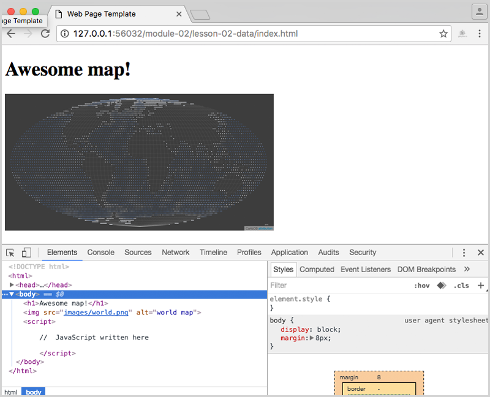  
Figure 07. A PNG image file loaded into the document and rendered in the browser.

Note that the image element has no closing tag. There are a few HTML elements that use what's known as "self-closing" tags, and the `` tag is one of these. 

This tag also contains two **attributes**. Attributes are additional values attached to an element that relate to or affect it in some way. In this case, the image element tag needs to know where to find the image to display. This is achieved through the `src` attribute or the URL of embeddable content. Attributes are followed by an equals sign and the value assigned to it, which is generally in quotations. Here in this example, we're telling the image element to look for a file named *world.png* in a directory named *images*. 

This particular URL path is a **relative path**. That is, it navigates through the file/directory structure from the current location of the *index.html* file. The relative path is opposed to a **absolute path**, which locates a particular file or directory from an absolute point of reference, such as a base URL (i.e., *http:// ...*). An example of such an absolute path is `https://developer.mozilla.org/en-US/docs/Learn`.

The relative/absolute distinction is important, so read more about [absolute vs. relative path/links](http://www.coffeecup.com/help/articles/absolute-vs-relative-pathslinks/) if it's still not clicking.

It's also a good idea to include the `alt` attribute with the image element and provide a description of the image. This text will appear if the image fails to load. People with visual impairments who use a screen reader also make use of these alt tags.

Read more about the [image element](https://developer.mozilla.org/en-US/docs/Web/HTML/Element/img) and [element attributes](https://developer.mozilla.org/en-US/docs/Web/HTML/Attributes).

### the paragraph element

The paragraph element is used to represent paragraphs of text, contained between two `<p></p>` tags.

Copy and paste the following HTML into your document (again, beneath the `` tag).

```html
<p>Additional information about the data and map goes here. Lorem ipsum dolor sit amet, consectetur adipiscing elit. Duis urna magna, maximus nec laoreet sit amet, dictum ultricies nibh. Ut id auctor lacus. Nam a dolor et justo luctus luctus.</p>
```

Refreshing our browser now renders the paragraph within the page.

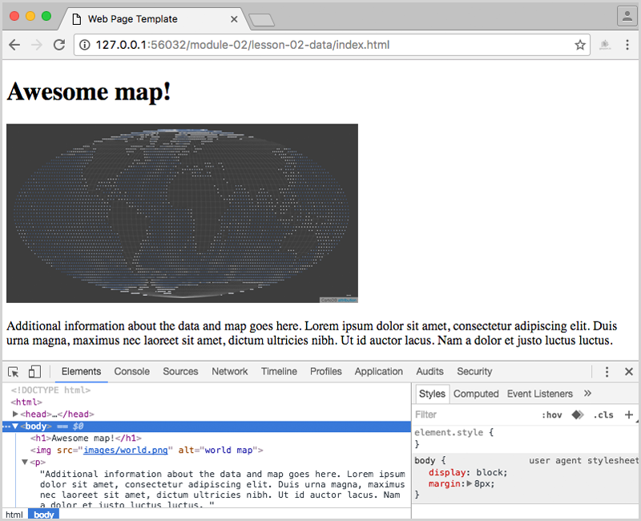  
Figure 08. A paragraph of text rendered within the browser.

Read more about [paragraph elements](https://developer.mozilla.org/en-US/docs/Web/HTML/Element/p).

### the hyperlink element

The key to the web is the ability to link to different HTML documents through the use of hyperlinks. We achieved this through the use of an anchor element (encoded using the `<a>` tags and the `href` attribute.

Modify the paragraph you just pasted into the document to include a hyperlink. We want to enclose the "link text" (i.e., what the user will click to send the HTTP request) using two `<a></a>` tags.

```html
<p>Additional information about <a href="#">the data</a> and map goes here.
```

Refreshing our browser reveals that our text is now blue and underlined. The key to the use of an anchor element for hyperlinks is to include some additional attribute information, in this case through the HTML attribute `href`. The value of this attribute

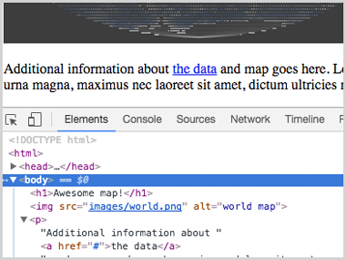  
Figure 09. A hyperlink added to the paragraph text.


If we click on it currently, it doesn't redirect us to another web page because that `#` symbol is not a new URL address. It is common to use a `#` symbol temporarily. Try replacing the `#` symbol with an HTTP address such as `http://leafletjs.com/` or `http://newmapsplus.uky.edu/`. Clicking on the link with then redirect the browser to that location.

Note that you'd wouldn't want an empty anchor element; it needs some content between the tags to be "clickable." This content can be any HTML element, such as an image or the text content of any other element (e.g., heading or list tags).

Read more about the[ anchor element](https://developer.mozilla.org/en-US/docs/Web/HTML/Element/a).

### the list element

It's often useful to organize our web writing using lists. To create lists within HTML, we use a set of nested elements. In this case we'll use an unordered list element (`<ul></ul>` tags) containing individual list item elements within in it. We enclose the actual content (textual or otherwise) within the `<li></li>` tags.

Copy and paste this HTML into your document, beneath the paragraph (note that you would NOT want to write a list element between the `<p></p>` tags):

```
<ul>
    <li>See my projects on GitHub: <a href="https://github.com/newmapsplus">New Maps Plus</a></li>
    <li>Follow me on twitter: <a href="https://twitter.com/NewMapsPlus">@NewMapsPlus</a></li>
    <li>Visit my <a href='#'>mapping portfolio</a>.</li>
</ul>
```

Refreshing the browser reveals we have added a bulleted list to our document.

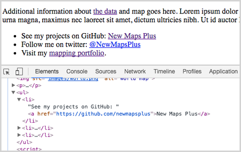  
Figure 10. A unordered list element added to the document.
        
Read more about [ordered list elements](https://developer.mozilla.org/en-US/docs/Web/HTML/Element/ol) and [list item elements](https://developer.mozilla.org/en-US/docs/Web/HTML/Element/li).

### division element

Let's now take the first step toward moving away from showing static image maps on the web toward web mapping. Replace the HTML `` tag with the following HTML:

```
<div id='map'></div>
```

The `<div></div>` tags represent a general container for any content, known as a division element. When we refresh our browser now, we do not see the division element within the page. This particular division element is currently empty and has no style rules applied to it. We're going to use them to demonstrate some CSS rules in the next section and eventually load a web map into the document using this division element as its container.

Importantly, this division element as written here also contains one of the most important attributes in web and web mapping development: the `id` attribute. The  `id` attribute's value can only be used once within the document and is a unique identifier for that element. In this example, the  `id` of  `map` can be used to identify and select that particular element within the DOM.

Read more about [division elements](https://developer.mozilla.org/en-US/docs/Web/HTML/Element/div), the [id attribute](https://developer.mozilla.org/en-US/docs/Web/HTML/Global_attributes/id).

Here we'll quickly introduce another HTML attribute that is as equally as important as the `id` attribute: the `class` attribute. 

This attribute works in a very similar way as the `id` attribute, except we can apply it to more than one element within the DOM.

Read more about the [class element](https://developer.mozilla.org/en-US/docs/Web/HTML/Global_attributes/class).

### section element

Before moving on to explore how we'll style these elements using CSS, we'll introduce one more HTML element: the section element, which represents a generic section of a document. Like the division element, the section element is used to wrap related or grouped content.

Within your web document, enclose the paragraph and list HTML elements we've written within two `<section></section>` tags (beneath the division element). It's also very common for section elements to begin with a heading tag describing the overall content of the section. In this case, we'll add a h2 header element: `<h2>about this map</h2>`.

```html
<div id='map'></div>

<section>
    <h2>about this map</h2>
    <!-- paragraph and list elements here -->
</section>
```

Again, refreshing the browser here won't reveal any visual changes on the section element, but we do see our h2 element.

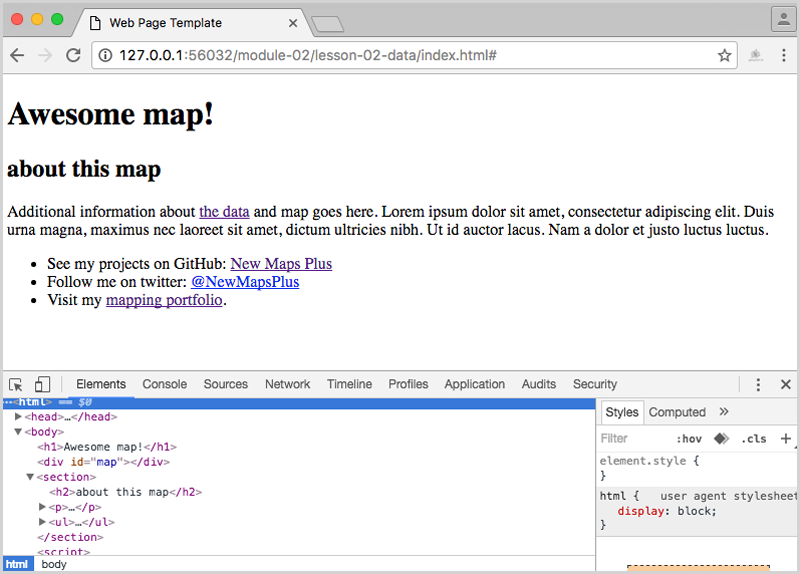  
Figure 11. Section and h2 elements added to the document.

Read more about the [section element](https://developer.mozilla.org/en-US/docs/Web/HTML/Element/section).

## Selecting and styling markup with CSS rules

The second component of design following content is the form that content takes (i.e., "how it looks"). Within our web documents, we give form to our content through the use of CSS, a stylesheet language which describes the presentation of HTML. We write CSS as a series of style rules.

We can either write these style rules in an external text document (a file that uses the extension *.css*) or within our HTML document between two `<style></style>` tags enclosed within the head element at the top of the document. We can also write style rules directly on elements, but it's best to avoid this practice. Within this course, we'll primarily be writing style rules using the second method, within the head element of our document for simplicity.

CSS is a powerful technology, but difficult to master. It works by first **selecting** an element in the DOM and then declaring various **property** values.

This graphic from the [w3schools](http://www.w3schools.com/css/css_syntax.asp) is useful for understanding the syntax of a CSS rule.

  
Figure 12. CSS Syntax

Read more about [CSS](https://developer.mozilla.org/en-US/docs/Web/CSS).

Let's now practice writing some CSS rules into our web document. Before we begin, however, we should note that the document is not completely without form. The web page we see in Figure 12. is not completely un-styled. The heading elements are larger than the paragraph elements, and there is space (i.e., margin or padding) around the elements. The hyperlink appears with its classic blue color and an underline. 

This is because the web browser itself has a default style sheet it applies to these elements (and beware: different web browsers use different style sheets).

  

### selecting and styling native HTML elements

We're going to be writing some style rules within the  `<style></style>` tags in the head of our document that will override and extend the default browser style sheet.

```html
<style>
    /*    CSS rules written here */
</style>
```

Write a CSS rule that selects the body element. We select elements with CSS by writing the element's tag name, followed by an opening and closing curly brace. We write the rule's declarations within these braces, and each declaration always ends with a semicolon.

```html
<style>
    body {
         /* rule declarations go here! */
    }
</style>
```
We're going to give the body element's margin and padding properties values of zero, make the body's background color  *#f5f5f5*  (the hex value for a whitesmoke color). We'll also declare the font family to be sans-serif and declare the font color to be *#3d3d3d*;

```css
body {
    margin: 0;
    padding: 0;
    background: #f5f5f5;
    font-family: sans-serif;
    color: #3d3d3d;
}
```

Save these changes in Brackets and then refresh your web page within the web browser. We can see that the background has changed, and the elements are now flush against the left side of the window. The rule is also affecting the typeface of the textual elements within the body tags. This is because these elements are "inheriting" the `font-family` and  `color`properties from the body element. CSS works through **inheritance**, which means that elements enclosed within other elements inherit some of their parent's properties (but not all). 

Again, understanding CSS is challenging and takes some time. We're mostly going to focus on JavaScript in the subsequent modules within MAP672, and within this lesson, we're aiming for a basic working knowledge of how CSS works within the web page.

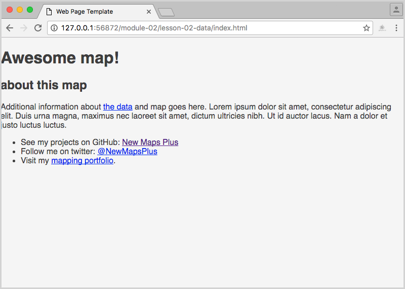  
Figure 13. Web page with body style rule applied

Next, let's add rules to select the section and header elements and style them. We'll constrain the width of the section and h1 elements to be 960px (pixels) wide. We're going to use the margin property to push the elements off the left side of the page. We also want to specify font sizes in units of `em`, which is a relative unit (rather than pixels).  Write these below the previous body element rule. 


```css
section {
    width: 960px;
    margin: 20px auto;
}

h1 {
    width: 960px;
    margin: 20px auto;
    font-family: serif;
    letter-spacing: .04em;
}

h2 {
    font-family: serif;
    letter-spacing: .04em;
}
```

Note that while the body is displaying the text using a serif font family, we can select specific elements like the h1 or h2 and make them display in sans-serif.

Examine these subtle changes in the web document within your browser by again saving the changes to the file within Brackets and then refreshing the page in your web browser. 

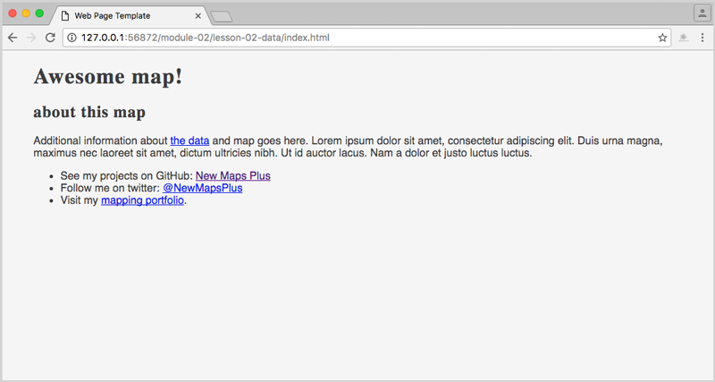  
Figure 14. Web page with heading and paragraph rules applied]

This will become a very familiar process that you'll repeat indefinitely as a web (map) developer:

1. write code
2. save changes
3. refresh in browser to see changes

Occasionally, this process will be punctuated by committing the saved changes to your Git repository (see Module 01).

Next, we'll style the hyperlink element so it's bold and a different color than the default blue. We're also going to apply what's known as a **pseudoselector** to the anchor element, `:hover`, which will apply a rule with the user mouses over the element. Let's also use the same technique to push our image 25 pixels off the left edge of its parent element (which is the body element). Continue with the following CSS rules:

```css
p {
    font-size: 1em;
    line-height: 1.5em;
}

a {
    color: #005daa;
    font-weight: bold;
    text-decoration: none;
}

a:hover {
    text-decoration: underline;
}

ul {
    padding-left: 20px;
}

li {
    margin: 10px 0
}
```

Save these changes and refresh the browser. Note again the subtle shifts with the margins, as well as the interaction the `:hover` pseudoselector provides when mousing over the actor tag.

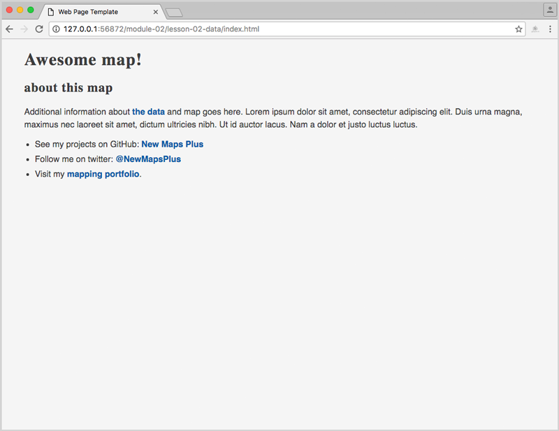  
Figure 14. Web page with elements styled.

If you're paying close attention, you should be thinking, "Wait! I thought CSS only handled form, and JavaScript handles behavior such as user interaction." It turns out that CSS is powerful and also shoulders some of the behavioral responsibility. This is more the case with recently updated specifications of CSS, which include [animations](https://developer.mozilla.org/en-US/docs/Web/CSS/animation) and [transformations](https://developer.mozilla.org/en-US/docs/Web/CSS/transform) of HTML elements.

Now spend some time tweaking the values for the style rules we've written so far to personalize the look and feel of your page. You may want to consult the [w3schools CSS Tutorial](http://www.w3schools.com/css/) to explore some of the many property options.

### selecting and styling elements using id and class attributes

Let's move on to work with the empty division tag we wrote into the HTML. While we can select all the division elements in the document with a CSS rule beginning with `div`, we instead want to select the unique division element with an identifier of "map."

In CSS, we select elements using a unique identifier attribute by using the `#` sign. So, we can write a style rule such as:

```css
#map {
    width: 960px;
    height: 540px;
    margin: 10px auto;
    border: 2px solid #d3d3d3;
}
```
This rule's declarations give the element's width a value of 960px and its height property a values of 540px, margin values of 10px on the top and bottom, and a value of `auto` for the left and right, which acts to center the element within its parent element (the body element in this case). The result is 

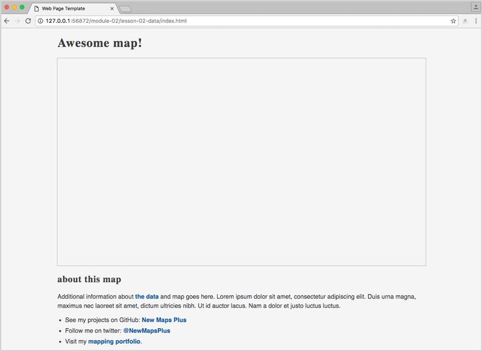  
Figure 14. Web page with dvision element styled.

That's enough CSS styling practice using our HTML elements for now. 

### loading externall CSS files

While for simplicity we can write our CSS rules between the `<style></style>` tags within the head of our *index.html* document, we often write these rules in external files and load them using the HTML link element.

Like the image element we explored above, the link element also uses the `href` attribute to load an external resource into the document. Paste the following into the head of your document, directly above the `<style></style>` elements within which we've been writing our custom CSS rules.

```html
<head>
    <meta charset=utf-8 />
    <title>Web Page Template</title>
    <meta name='viewport' content='initial-scale=1,maximum-scale=1,user-scalable=no' />
	
    <link href="https://cdnjs.cloudflare.com/ajax/libs/normalize/5.0.0/normalize.css" />
    <link rel="stylesheet" href="https://unpkg.com/leaflet@1.0.1/dist/leaflet.css" />
    <link href="https://fonts.googleapis.com/css?family=Noto+Sans" rel="stylesheet">
    <link href="https://fonts.googleapis.com/css?family=Lora" rel="stylesheet">
```

These four elements load four separate CSS stylesheets into our document:

* The first, a CSS "reset" sheet called [Normalize.css](https://necolas.github.io/normalize.css/), helps content display more consistently across different browsers.
* The second loads the [Leaflet mapping library's CSS rules](https://github.com/Leaflet/Leaflet/blob/master/dist/leaflet.css).
* The third and fourth load additional fonts into the document, from [Google Fonts](https://fonts.google.com/)

Remember that your user may not have the same fonts installed as you do. Loading in the fonts from Google is a good way to use fun, beautiful typeface within your web document and map.

Once we load these fonts into the document, we can modify our style rules to include them on particular elements (note the changes to the `font-family` property:

```css
body {
    margin: 0;
    padding: 0;
    background: #f5f5f5;
    font-family: "Noto Sans", sans-serif; // change made here
    color: #3d3d3d;
}

h1 {
    width: 960px;
    margin: 20px auto;
    font-family: Lora, serif;   // change made here
    letter-spacing: .04em;
}

h2 {
    font-family: Lora, serif;   // change made here
    letter-spacing: .04em;
}
```

We've now created a basic, minimal map page template using HTML and CSS. Now let's move on to consider the web map.

## Controlling behavior with JavaScript

So far we've designed a basic web page using content (HTML) and form (CSS). The final component of a web experience is interaction and event-driven behavioral changes to the elements. To control the behavior within a web document, we will use JavaScript, or JS for short, a programming language used broadly across modern web development today.

We're going to begin learning JavaScript from the ground up, beginning in the next module. For now, we'll run through some basic examples to demonstrate how JS works with HTML and CSS within interactive web design.

While we may load external JS files with `<script>` tags in the head of our document (in similar ways as we loaded the external CSS files), we're going to be writing our custom JavaScript between two `<script></script>` tags at the bottom of our document, directly before the final `</body>`tag. 

Keep in mind that computers are particularly finicky, and they need things written precisely. Otherwise, the program breaks and produces what's known as an "error". 

Keep your developer tools open within your web browser as you write and test JavaScript. Ensure the **Console** tab is active, found along the row of options at the top. 

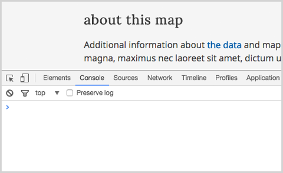  
Figure 14. Developer tools with the console tab active

When you refresh your page, you may see JavaScript errors displayed within this Console. Look carefully at those, as they give you clues as to what line of JavaScript you may not have written correctly.

We're now going to write several JavaScript statements to demonstrate some concepts. Don't be alarmed if the code makes no sense. It's not supposed to yet! You can cut and paste the snippets from this document or practice typing them yourself in Brackets. The important thing, for now, is that you begin to cultivate a quality of looking closely at the JavaScript and ensuring that the syntax and code **match the working example exactly**. Capitalization matters. Dots and hyphens matter. All punctuation matters.

For the following JavaScript examples, write the code into your index.html file, **save the changes**, and then refresh your web page to see the results. Write each example beneath its predecessor, within `script` tags.

Just like CSS, JavaScript can select elements in the DOM and then manipulate them. JavaScript can even select elements and then apply CSS style rules to them! This first example will select our `h1` heading and change the text within it:

```javascript
document.querySelector('h1').innerHTML = 'web mapping is sweet!';
```

We can also select an element by its unique identifier. This example selects an element with an `id` of 'box.' It then stores a reference to this selected element and changes the `background ` style to a new color.

```javascript
var map = document.getElementById('map');
map.style.background = '#4d4a9f'; 
```

The previous examples ran once the DOM loaded and the browser interpreted the JavaScript. But we can also attach what's known as an "event listener" to elements and wait for some user interaction before doing something. This example attaches a click event listener our previously selected 'box' division and then changes the width of the element.

```javascript
map.addEventListener('click', function() {
    this.style.width = '400px';   
});
```

JavaScript can also create new elements and insert them into the DOM. This example creates a new list item element, inserts some text into it, and then selects our existing unordered list element. The newly created list item is then appended (inserted at the end) of the unordered list.

```javascript
var newListItem = document.createElement('li');
newListItem.innerHTML = "list item 4";
document.querySelector('ul').appendChild(newListItem);
```

Again, we're not looking to comprehend this JavaScript right now fully. The point of these examples is to demonstrate how JavaScript dynamically interfaces with the DOM elements conceptually.

What's  important is a little JavaScript statement known as the [Console.log() API](https://developer.mozilla.org/en-US/docs/Web/API/Console/log).

### logging JavaScript to the browser developer tools console

An important feature of the developer tool's Console tab lies in our ability to write messages in JavaScript for this output. We will be doing this often, often during debugging. For now, we're simply going to write one line which will output a simple text message to the console.

```javascript
console.log("hello map");
```

Save this code and refresh your browser. You should see the text outputted within the Console.

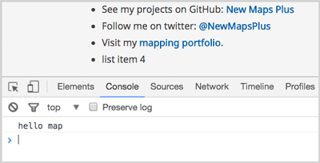  
Figure 15. Logging "hello map" to Console.

We'll have a better understanding of the specific syntax of this statement when we cover functions and methods in Module 06. For now, it's important to note that the opening and closing parenthesis are necessary. This JavaScript statement will attempt to log whatever is between them to the JavaScript Console. So, just like HTML tags or the curly braces of a CSS declaration, it's important to ensure a closing one always follows an opening parenthesis.        

### Using JQuery

As we've said, these JavaScript examples are merely to get you acquainted with the development environment and to help you understand how HTML (content), CSS (form), and JavaScript (behavior) work in concert to produce an interactive web page. We wrote these examples in native JavaScript. Often, however, web developers will use a fabulous JavaScript library which abstracts, or makes simpler and easier, writing Javascript. This library is [JQuery](https://jquery.com/).

To use JQuery, which itself is JavaScript code, you need to load it into your DOM. You load the [latest version of JQuery](http://code.jquery.com/) from an external server through a Content Delivery Network (CND). This code can be placed either in the head of your document or toward the bottom, directly above the custom JavaScript you've written between the `<script></script>` tags:

```html
<head>
    <meta charset=utf-8 />
    <title>Web Page Template</title>
    <meta name='viewport' content='initial-scale=1,maximum-scale=1,user-scalable=no' />
	
    <link href="https://cdnjs.cloudflare.com/ajax/libs/normalize/5.0.0/normalize.css" />
    <link rel="stylesheet" href="https://unpkg.com/leaflet@1.0.1/dist/leaflet.css" />
    <link href="https://fonts.googleapis.com/css?family=Noto+Sans" rel="stylesheet">
    <link href="https://fonts.googleapis.com/css?family=Lora" rel="stylesheet">
	
    <script src="http://code.jquery.com/jquery-3.1.1.min.js" integrity="sha256-hVVnYaiADRTO2PzUGmuLJr8BLUSjGIZsDYGmIJLv2b8=" crossorigin="anonymous"></script>
</head>
```

OR

```html
<script src="http://code.jquery.com/jquery-3.1.1.min.js" integrity="sha256-hVVnYaiADRTO2PzUGmuLJr8BLUSjGIZsDYGmIJLv2b8=" crossorigin="anonymous"></script>    
    // custom JavaScript goes here
</script>
```

Finally, why do we write our custom JavaScript at the bottom of the document? We do this because our HTML document is interpreted top to bottom by the web browser, and JavaScript may be seeking to select or manipulate an element within the body element. These elements need to be accessible within the DOM before JavaScript attempts to select them. For instance, in these examples, we selected the existing unordered list element and appended a new list item element to it. If that JavaScript had run before the unordered list existed, it would have thrown an error (i.e., the script would have broken).

## Commenting your code

When writing HTML, CSS, or JavaScript, it is often the case that we wish to either write notes for ourselves or others as plain-text (i.e., text that we don't want to be interpreted as code), or we want the browser to temporarily ignore blocks of HTML, CSS, or JavaScript. To achieve this, we use what's known as comments. 

Comments are written differently for HTML, CSS, and JavaScript.

Within **HTML**, comments are written with the following syntax: 

`<!-- comment goes here -- >`.

Within **CSS**, comments are written with the following syntax: 

`/* comment goes here */`

And, within **JavaScript**,  comments are written with the following syntax, either for a single line of code: 

`// comment goes here`

or for a block of code:


```javascript
/*   
    Several lines of 
    code can be commented out
   in this way
*/
```

You'll be commenting code for three reasons within this course. The first two were mentioned above: 1.) to provide plain-text descriptions or notes to yourself and other users of your software to better understand the code, and 2.) to comment out chunks of code you don't want to run, often within the process of debugging.

We'll provide you with further instructions into these use cases for commenting. A third reason you'll be commenting is to show your instructor you understand the code you've written within this course . Your comments may even be an overly-verbose form of commenting you wouldn't normally write into production code.

Within Brackets (and other text editors), you should figure out how to quickly comment and uncomment blocks of code. You do this by selecting (highlighting) a large block of text and then toggling the comments on or off (i.e., you don't want to manually write the code opening and closing). See **Edit -> Toggle Line Comment** or **Edit -> Toggle Block Comment**.

## Leaflet and your first hello world map

Just as we loaded Leaflet's CSS from a remote source, we'll do the same for the Leaflet JavaScript, which will do all the heavy lifting for easily making web maps. To use Leaflet, include it in your DOM. You can load it where you choose to load your JQuery (and other external JS libraries).

```html
<script src="http://code.jquery.com/jquery-3.1.1.min.js" integrity="sha256-hVVnYaiADRTO2PzUGmuLJr8BLUSjGIZsDYGmIJLv2b8=" crossorigin="anonymous"></script>    

<script src="https://unpkg.com/leaflet@1.0.1/dist/leaflet.js"></script>
<script>
    // custom JavaScript goes here
</script>
```

Now that the Leaflet JavaScript is loaded into your document, write the following custom JavaScript between the `<script></script>` tags:

```javascript
var options = {
    center: [38.0406, -84.5037],
    zoom: 12
}

var map = L.map('map', options);

var tiles = L.tileLayer('http://{s}.basemaps.cartocdn.com/light_all/{z}/{x}/{y}.png', {
    attribution: '&copy; <a href="http://www.openstreetmap.org/copyright">OpenStreetMap</a> &copy; <a href="http://cartodb.com/attributions">CartoDB</a>',
    subdomains: 'abcd',
    maxZoom: 19
}).addTo(map);

var message = 'Lexington is awesome!';

L.marker(map.getCenter())
    .bindTooltip(message)
    .addTo(map)
    .openTooltip();
```

Save these changes and refresh your browser. If there were no errors in the code (which the Console would display in red), you should see a minimal basemap centered on Lexington, KY, with a message displayed on a marker.

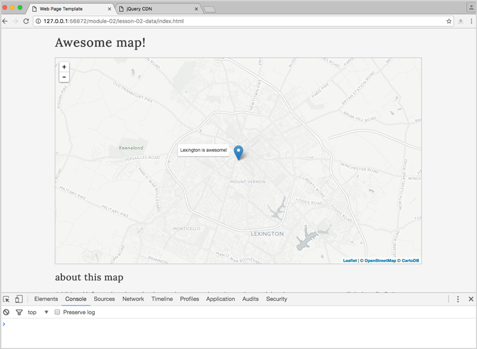  
Figure 15. Hello World Map.

Save the changes to this document and keep this as a template for starting future projects. Now move on to read the instructions for [lab-02](https://github.com/newmapsplus/map672/blob/master/module-02/lab-02/lab-02.md).

## Addition Resources
* [W3C Schools](http://www.w3schools.com/): accessible and useful resource for learning and referencing a variety of web languages (HTML, CSS, JavaScript)
* [CodeAcademy](http://www.codecademy.com/): online, interactive environment for learning a variety of web programming languages such as HTML, CSS, and JavaScript
* [Mozilla Developer Network](https://developer.mozilla.org): comprehensive resource for all things web, including guides and tutorials for [HTML](https://developer.mozilla.org/en-US/docs/Web/Guide/HTML) and [CSS](https://developer.mozilla.org/en-US/docs/Web/Guide/CSS)

## Definitions

* **HTML**: HyperText Markup Language is the text-based markup language used describe all documents (i.e., pages) and document elements on the World Wide Web
* **CSS**: Cascading Style Sheets define how HTML elements are displayed (e.g., their size, color, or position)
* **JavaScript**: the (current) modern programming language of the Web
* **Tag (HTML)**: a component of HTML that represents one node within a hierarchy of nodes, normally composed of an opening and closing tag which contain content within
* attribute: used to provide additional information about an HTML page, normally included within the opening tag (e.g., id, class, href)
* **id (HTML)**: an attribute that specifies a unique identifier for a particular HTML element 
* **class (HTML)** an attribute that specifies a class (i.e., similar category) for a number of HTML elements, allowing CSS rules to be uniformly applied to them
* **Selector (CSS)**: allows CSS to “find” HTML elements based on an attribute such as an id or class, and to apply style rules or otherwise manipulate the element (as through JavaScript)
* **Declaration (CSS)**: component of a CSS rule comprising a property (e.g., color) and a corresponding value (e.g., blue)