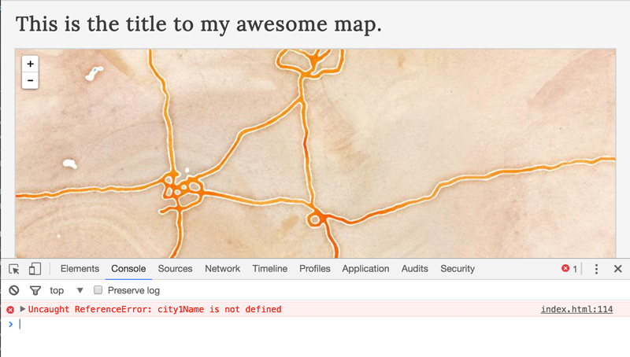
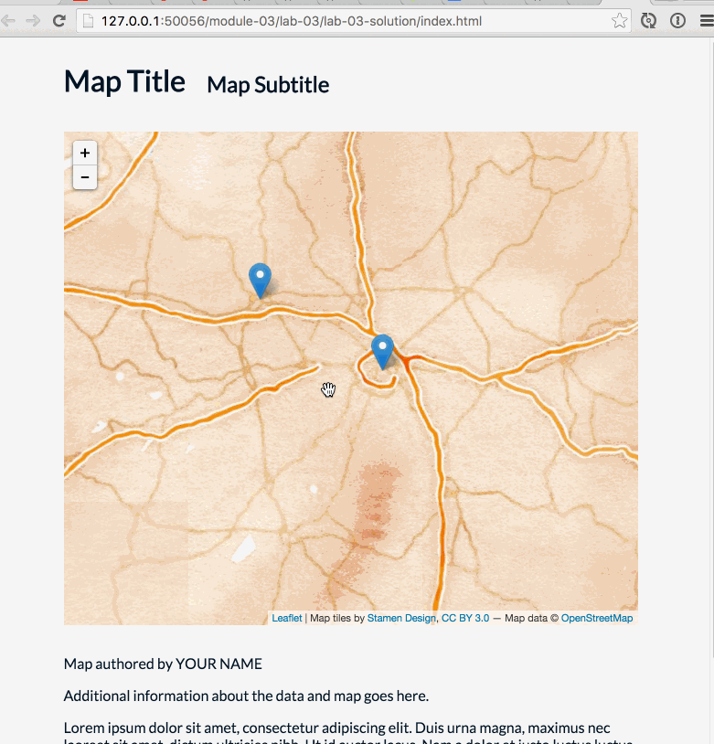

# Lab 03: Adding Markers for City Locations with Population Data

**Instructions:** First, be sure you've copied over the */map672-fall16/module-03/* directory into the root directory of your *map672* Git repository. Modify the index.html within the *lab-03-data* directory to fulfill the requirements listed below. The goal of this lab is to create three markers on the map for three different Kentucky cities and provide information about those cities on a clickable popup. 

The *lab-03/index.html* file contains more Leaflet code that you won't recognize yet, which is okay. Here we're "black boxing" the Leaflet code that makes the map work, for now, so we can focus on the JavaScript fundamentals.

Edit and save your changes to your *index.html* file and **commit changes to your local GitHub repository** as you work. 

To begin editing the code, open the *module-03/* directory using Brackets. Double-click on the *lab-03-data/index.html* file, and view the rendered page within Chrome using Live Preview. Remember, it's easiest to open the entire *module-03/* directory within Brackets and then open the individual files you want within Brackets' **Working Files**. 

Open your JavaScript Console within your web browser and note that there is an Uncaught ReferenceError on line 114. 



This script is looking for values referenced by variables that do not yet exist, hence it's throwing a `ReferenceError`. You will need to write these variables and values and uncomment sections of the script below that will add additional markers to the map. 

Modify the JavaScript within the section beginning the code comment `// BEGIN WRITING CODE FOR LAB 03 HERE` and ending with `// END WRITING CODE FOR LAB 03 HERE`.

To start, declare a variable named `city1Name` and assign it a string value of `"Lexington"`, like so:

```javascript
var city1Name = "Lexington";
```

Save your file, and refresh to browser to test the results (both within the map and the JavaScript Console). Now continue writing JavaScript and complete the following:

1. Declare a variable named `city1Lat`, determine the latitude of this city (e.g., using a Google search) and assign this number value to it. Do the same for a variable named `city1Lon` for the longitude.
2. Declare a variable named `city1Pop`, short for the population of the city, which you should also determine using a web search, and assign this numeric value to the variable.
3. Declare a variable named `city1Capital` and assign a Boolean variable of either `true` or `false`, depending on whether this city is, in fact, the capital of the Commonwealth of Kentucky.
4. Save your changes, refresh your browser, and verify a marker has been correctly placed on Lexington and the popup information is correct. Look for errors in the JavaScript Console and return to your code to fix these errors.
5. Repeat this process for two more cities, Frankfort and another of your choosing. Name the related variables `city2` (i.e., `city2Name`, etc) and `city3`. **Note that you'll need to uncomment the code toward the bottom of the script for each city** for the script to run correctly.
6. Declare a variable named `totalPop` and assign it the sum of the three city's populations, using their variables and the plus operator. Log this total to the JavaScript Console, preceded by the text, "The total population of these cities is: ". 
7. Next, declare a variable named `averagePop` and assign it a value of the cities' population average using a division operator (i.e., do not simply do the math yourself and hard code this value into the script). The text, `"The average population of these cities is: "` should precede the numeric value in the console log output .
8. Declare a variable named `cities` and assign it an array literal containing the three city names in their order created. On the next line, log the last item within the array to the Console using bracket notation.
9. Finally, change the `h1` and `h2` tags to update your web document with an appropriate (even fun!) title and subtitle, update the content between the two `<title></title>` tags. and edit the text at the bottom of the page (e.g., author and meta information).

Also, be sure that the *lesson-03-data/index.html* file is complete with the examples detailed in Lesson 03 and synced/pushed up to your GitHub repo. Commenting this lesson index file will help solidify your knowledge!

Sync your final solutions with your remote repository and provide a link to your repository within Canvas by the due date.

Your final solution should look like this (with a meaningful yet fun title and subtitle!):
