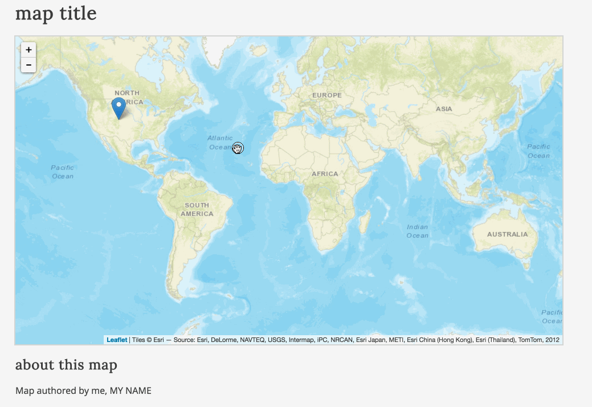
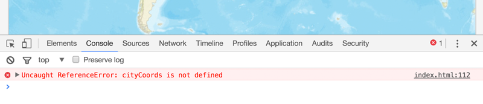

# Lab 04: JavaScript Arrays and Control Structures

**Instructions:** Begin by editing the *lab-04/lab-04-data/index.html* Starter Template to fulfill the requirements listed below. 

The goal of this lab is to update the code written in Lab 03 to again place 3 markers on the map for 3 different cities and provide popup information about their relative population sizes. However, we want to make the code less redundant by using arrays and looping structures, rather than separate variables for each respective city.

First launch the *lab-04/lab-04-data/index.html* Starter Template file using Live Preview in Brackets. You'll notice the map loads with the entire world in view. A Leaflet marker is also placed on the US city of Denver, Colorado. A popup displays the name of the city and the population for 2015.

  
Figure 01. The initial view of the Starter Template file.

Before we begin this lab, let's look carefully at the JavaScript code that is provided. While we won't get into really understanding what all the Leaflet code is doing until Module 07, we can begin to get a basic sense of how this web map is working. Let's break this code down.

The JavaScript begins by creating a new variable named `options` and assigns a complicated looking bit of code to it. This is a JavaScript object (contained within the two `{ }` curly braces), but we won't get into objects until Module 06. 

What's important for now is that we should already recognize a couple of the values written within it.

```javascript
var options = {
    center: [0, 0],
    zoom: 2
}
```
The `[0, 0]` following the word `center` is an array, the first value being the latitude of the center of the map, and the second being the longitude. The number `2` following `zoom` is the initial zoom level. 

The next bit of code creates a Leaflet map using these options, requests some basemap tiles, and adds it to the map.

```javascript
// instantiate Leaflet map object
var map = L.map('map', options);

// request remote basemap tiles
var tiles = L.tileLayer('http://server.arcgisonline.com/ArcGIS/rest/services/World_Street_Map/MapServer/tile/{z}/{y}/{x}', {
attribution: 'Tiles &copy; Esri &mdash; Source: Esri, DeLorme, NAVTEQ, USGS, Intermap, iPC, NRCAN, Esri Japan, METI, Esri China (Hong Kong), Esri (Thailand), TomTom, 2012'
});
// add tiles to map
map.addLayer(tiles);
```

We don't need to mess with any of this code right now. However, you may be interested to know that you can swap out these basemap tiles with other available tilesets. Many of these are demonstrated here at [Leaflet Providers](https://leaflet-extras.github.io/leaflet-providers/preview/).

Moving on to the example provided, the script first declares two variables and assigns some values to these. Simple enough!

```javascript
// variable to hold string value of city name
var cityName = "Denver";

// variable to hold number value of city population
var cityPopulation = 649495;
```

The next variable assignment is a little complicated. We'll be building lots of popups (and tooltips) in the future, so take the time to understand this.

The variable `popup` is assigned a string value. This value is composed of string values concatenated (using the `+` operator) with the existing variable values (the numeric value of `649495` is coerced to a string).

```javascript
// build a string with HTML tags and content
var popup = "<b>" + cityName + "</b><br>" +
            "<b>population</b>: " + cityPopulation;
```

It's a bit tedious to write these carefully, so take your time with these. It's also helpful to break longer concatenated string statements like this into multiple lines, hitting return in your text editor after the `+` sign.

The next statement does a lot of work. As the comments describe, the code creates a new Leaflet marker. Note that the value enclosed between the two `( )` parentheses is a JavaScript array, containing two numeric values that are latitude and longitude values for where the marker will be placed. This marker is added to the map, and the content of our popup is "bound" to that marker. 

```javascript
// create a Leaflet marker at the coordinates of Denver, CO
// add it to the map
// and bind the popup content to the marker.
L.marker([39.74, -104.99]).addTo(map)
    .bindPopup(popup);
```

Again, while the specifics of the Leaflet code (`L.marker()`) should not make complete sense right now, the important thing is to pay careful attention to the code when you're replicating examples. Before continuing with the lab, make the following changes to the current script.

Replace the array `[39.74, -104.99]` with the word `cityCoords`:

```javascript
L.marker(cityCoords).addTo(map)
    .bindPopup(popup);
```

Save these changes and refresh your browser (with your JavaScript Console open). The marker will not be added to the script, and you'll see that an error has been generated.

  
Figure 02. An uncaught reference error in the script.

We can begin debugging the error by noting that it was generated on line 112 (obviously the line we just edited). The script is looking for a variable or value to use there, but `cityCoords` has not yet been defined.

Declare the variable and assign the array of coordinates to it:

```javascript
var cityCoords = [39.74, -104.99];
```

*Question:* Where do you write this line? Above or below the `L.marker(cityCoords)` statement? Try both and be clear in your mind why one of these is correct.

Let's now move on to the lab. First, comment out the existing JavaScript code below line 97 that adds the tiles to the map.

Rather than mapping the same cities in Kentucky as in Lab 03, choose three new cities. These can be within a US state, within another country, or three cities within three different countries. Choose two cities that are not capital cities and one that is (or visa-versa). 

Follow these steps to complete the lab.

1. Declare a variable named `cities` and assign an array to it, containing the string value names of your 3 cities.

2. Create a 2-dimensional array named `cityCoords` that contains 3 elements: each one an array containing the latitude and longitude of each of the three cities listed in the `cities` array. Be careful to ensure that the index for each array of coordinates corresponds to the index for each city name in the `cities` array. In other words, if "Lexington" is the first city within the `cities` array, then Lexington's coordinates should be the first array within the `cityCoords` array.

3. Create two more arrays, named `cityPops` and `cityCapital`. The `cityPops` array should contain the populations of the respective cities in the `cities` array (again, be careful with the order of these as they should be congruent with the other arrays already created). The `cityCapitals` array should contain three Boolean values (i.e., `true` or `false`) designating whether the corresponding city in the `cities` array is or is not the capital of the state or country you're mapping.

4. After these data structures have been carefully built, your task is to write a for loop structure to cycle through all elements in the `cities` array, create a new Leaflet marker for each using that city's coordinates, and bind the popup population information to each. The popup should also include a statement indicating whether or not the city is a capital city (i.e., "is the capital city").

    Study the final examples in Lesson 04 for additional guidance.

    Once you've decided on three cities, adjust the latitude, longitude, and zoom levels of the `options` values so that your map loads with the center roughly in the middle of these cities and so that they're all visible upon the page load.

    Once you ave successfully completed these steps, the map should load and operate just as the solution for Lab 03 (only the underlying JavaScript code will be running more efficiently with arrays and loops!). 
    
5. Finally, change the `h1` to update your web document with an appropriate (even fun!) title, and edit the text at the bottom of the page (e.g., author and meta information).

Save your changes to the *index.html* file and **commit changes to your local GitHub repository** as you work. 

Also, be sure that the *map672-fall16/module-04/lesson-04-data/index.html* file is complete with the examples detailed in the *lesson-04.md* instructions and Synced up with your GitHub repo.

Sync your final solutions with your remote repository and provide a link within Canvas by the due date.